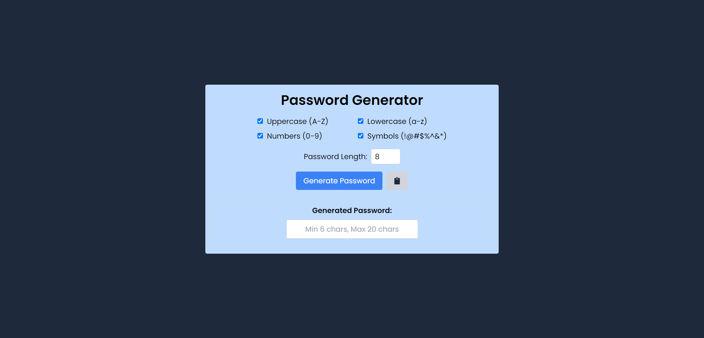

# Password Generator

## Description
This is a simple password generator application built using React.js. It allows users to generate secure passwords with customizable options such as including uppercase letters, lowercase letters, numbers, and symbols. The application provides a user-friendly interface where users can easily generate passwords and copy them to their clipboard.

## Features
1. Generate secure passwords with customizable options.
2. Copy generated passwords to clipboard with a single click.

## Technologies Used:
React.js
Tailwind CSS

## How to Use:
1. Clone this repository to your local machine.
2. Navigate to the project directory.
3. Install dependencies using `npm install`.
4. Start the development server using `npm run dev`.
5. Access the application in your web browser at `http://localhost:5173`.